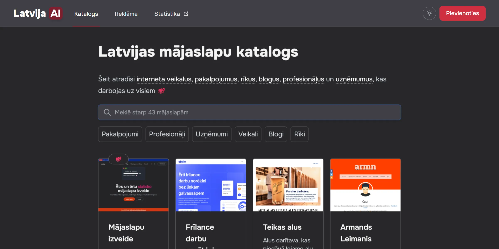

# Latvija.ai mājaslapu katalogs

[Latvija.ai](https://latvija.ai) — centralizēta platforma, kurā apkopotas dažādas Latvijas mājaslapas, sākot no e-veikaliem un pakalpojumu sniedzējiem līdz blogiem un specializētiem profesionāļiem.

### Galvenās funkcijas un priekšrocības

- Plašs piedāvājumu klāsts: Platforma aptver dažādas nozares – no apdrošināšanas un tulkošanas pakalpojumiem līdz mākslas projektiem un amatniecībai.
- Bezmaksas pievienošanās: Uzņēmumi un privātpersonas var bez maksas pievienot savas mājaslapas katalogam, tādējādi palielinot savu redzamību.
- Atbalsts vietējiem uzņēmumiem: Platforma veicina Latvijas uzņēmumu attīstību, sniedzot tiem iespēju sasniegt plašāku auditoriju.

Projekta autors ir [Armands Leimanis](https://armn.me).
Lapu veido un uztur SIA "Sociālais kods".
E-pasts saziņai: [latvija@labojam.lv](mailto:latvija@labojam.lv)
